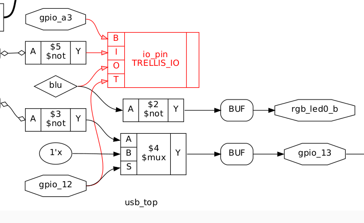

# bidirectional_test
testing normal way vs Lattice primitives for bidirectional (Hi-Z) pin
This is a graphical representation of my RTL.  

Does the IO associated with gpio_13 get converted to primitives (presumabably TRELLIS_IO) at the PNR step?  

Is TRELLIS_IO the same as Lattice sysI/O?
